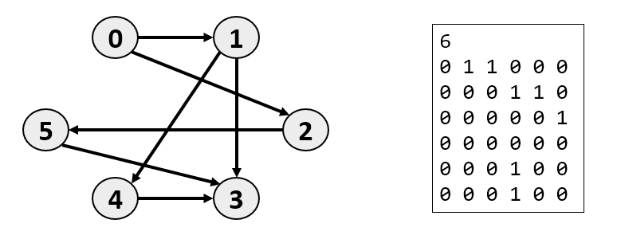
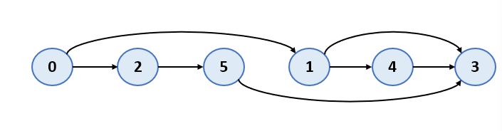
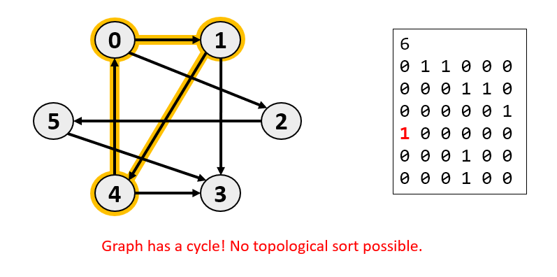

# Topological Sort with Cycle Detection (C++)

This project implements **Topological Sorting** in directed graphs with integrated **Cycle Detection** using **Depth-First Search (DFS)**.  

---

## ✨ Features
- Reads graph input from a file (`graph.txt`)
- Detects cycles in directed graphs
- Prints a valid topological order if no cycle exists
- Implemented using **DFS**, **Stack**, and **Color Marking Technique** (`WHITE`, `GRAY`, `BLACK`)

---

## 📂 Project Structure

├── main.cpp # Source code

├── graph.txt # Input graph (Adjacency Matrix)

├── README.md # Project documentation

└── assets/ # Example graphs and outputs (images)

---

## 📥 Input Format (`graph.txt`)
- **Line 1**: Number of vertices `n`  
- **Next n lines**: Adjacency matrix (`n x n`)  
  - `1` → there is a directed edge `i -> j`  
  - `0` → no edge  

### Example Input
6

0 1 1 0 0 0

0 0 0 1 1 0

0 0 0 0 0 1

0 0 0 0 0 0

0 0 0 1 0 0

0 0 0 1 0 0

---

## 📊 Example Graphs and Results

### ✅ Acyclic Graph
Input graph (Adjacency Matrix + Graph Visualization):

  

**Output:**

0 2 5 1 4 3

---

### ❌ Cyclic Graph
Input graph (contains a cycle):

6

0 1 1 0 0 0

0 0 0 1 1 0

0 0 0 0 0 1

1 0 0 0 0 0

0 0 0 1 0 0

0 0 0 1 0 0

**Output:**

Graph has a cycle! No topological sort possible.

Technologies

Language: C++17

Algorithm: DFS (Depth First Search)

Data Structures: Stack, Vector

👤 Author

Name: Parsa Zamani

GitHub: github.com/parsazamani1383

Email: parsazamani.uok@gmail.com

